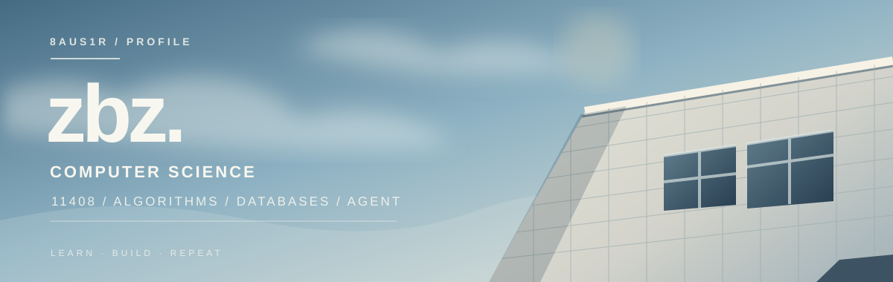

<h3>计算机专业学生 · 备考 11408</h3>

把基础学扎实，把想法写成能运行的东西。

  <a href="https://github.com/8aus1R/MewCode">MewCode</a>
  &nbsp;·&nbsp;
  <a href="https://space.bilibili.com/68534484">Bilibili</a>
  &nbsp;·&nbsp;
  <a href="https://www.douyin.com/user/MS4wLjABAAAAfMMMAMkXDWRNCu_KtJq6urPe5G3LRhyK-oEYmwGsy9Q">Douyin</a>

---

## 现在在做

> 备考 **11408**，持续练习算法，系统整理数据库知识，也在开发自己的 AI Agent 项目。

| 方向 | 关注点 |
| :--- | :--- |
| **01 / 算法与数据结构** | 从题目出发，练思路、分析复杂度、整理数据结构与解题方法。 |
| **02 / 数据库** | 围绕 SQL、索引、事务等主题学习，把概念和实际使用串起来。 |
| **03 / AI Agent** | 在 [MewCode](https://github.com/8aus1R/MewCode) 中实践模型调用、工具使用与 Agent Loop。 |

算法和数据库的笔记正在整理中，仓库入口会在上传后补上。

---

## 正在构建 · MewCode

### [MewCode →](https://github.com/8aus1R/MewCode)

一个从零开始构建的 **Python 命令行 AI 助手**。我用它探索 Agent 如何在多轮对话中调用工具、管理上下文，并在明确的权限边界内执行任务。

`Python` · `Agent Loop` · `Tool Calling` · `MCP` · `Context & Memory` · `Permissions`

目前已实现交互式对话、流式输出、工具调用与自主循环，并支持多种模型服务。更完整的功能和使用方式可以在 [项目 README](https://github.com/8aus1R/MewCode#readme) 中查看。

---

继续学，继续做。 · 视觉灵感来自艾志恒 Asen 的 <a href="https://music.apple.com/cn/album/%E5%9C%A8%E9%9B%A8%E5%90%8E%E9%86%92%E6%9D%A5/1845141403">《在雨后醒来》</a>

  

